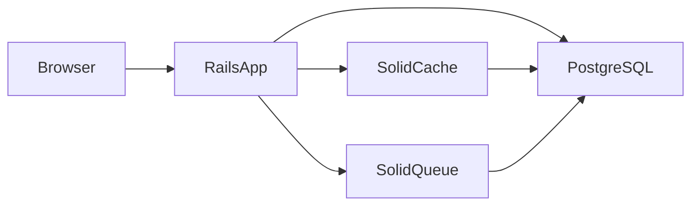

# AtlasQuant

> Веб-приложение для отслеживания валютных фьючерсов MOEX и аналитики базиса, контанго и стоимости удержания.

AtlasQuant помогает пользователям отслеживать динамику инструментов FORTS и получать аналитику по текущим рыночным условиям: базис фьючерса к споту, контанго/бэквордация и annualized implied yield до экспирации. Стратегическое решение: [docs/decisions/001-product-core-moex-basis.md](docs/decisions/001-product-core-moex-basis.md).

---

## Описание

### Назначение

AtlasQuant — это веб-приложение для отслеживания валютных фьючерсов MOEX FORTS с расчётом базиса и стоимости удержания. Сервис предоставляет пользователям возможность:

- отслеживать динамику инструментов в персональном списке;
- получать аналитику по текущим рыночным условиям (базис, контанго);
- рассчитывать implied cost of carry по цене фьючерса, споту и дням до экспирации.

### Предметная область

| Термин | Описание |
|--------|----------|
| Валютный фьючерс MOEX | Срочный контракт FORTS с базовым активом — валютной парой (`Si`, `Eu`, `Cn`, `ED`) |
| Базис | Разница цены фьючерса и спота: `B = F − S`; положительный базис — контанго |
| Implied yield | Годовая доходность cash-and-carry: `r = (F/S − 1) × (365 / T)` |
| MOEX perpetual | Квази-perpetual MOEX (`USDRUBF`); анализируется через базис к споту, не crypto funding |

### Архитектура



Приложение построено на Ruby on Rails 8. Кэш, фоновые задачи и Action Cable используют адаптеры Solid (хранение в PostgreSQL), без отдельного Redis-сервера.

### Доменные сущности

| Сущность | Статус | Назначение | Evidence |
|----------|--------|------------|----------|
| `User` | ✅ реализовано | Авторизация и персонализация | `app/models/user.rb` (#1) |
| `Moex::CurrencyFutures::List::Instrument` | ✅ value object | Данные инструмента из MOEX ISS (без AR) | `app/services/moex/currency_futures/list.rb` (#4) |
| `Instrument` | ⬜ backlog | AR-модель персонального списка инструментов | — |
| `BasisCalculator` (сервис) | ⬜ backlog | Расчёт базиса и implied yield по `(F, S, T)` | ADR-001 |

---

## Технологический стек

### Основные компоненты

| Слой | Технология | Статус | Файлы / гемы |
|------|------------|--------|--------------|
| Backend | Ruby 3.2.11, Rails 8.1 | есть | `.ruby-version`, `Gemfile` |
| База данных | PostgreSQL | есть | `config/database.yml` |
| Кэш | Solid Cache (PostgreSQL) | есть | `solid_cache`, `config/cache.yml` |
| Фоновые задачи | Solid Queue (PostgreSQL) | есть | `solid_queue`, `config/queue.yml` |
| WebSocket | Solid Cable (PostgreSQL) | есть | `solid_cable`, `config/cable.yml` |
| Frontend | Tailwind CSS, Hotwire (Turbo + Stimulus), importmap | есть | `tailwindcss-rails`, `Procfile.dev` |
| Тестирование | Minitest (текущий) / RSpec + SimpleCov (целевой) | Minitest в `test/` (~13 файлов) | `test/`; `spec/` — backlog |
| Среда разработки | Mise | есть | `mise.toml` |
| Деплой | Kamal, Docker | есть | `Dockerfile`, `config/deploy.yml` |

### Solid вместо Redis

Проект использует экосистему **Solid** (Rails 8 по умолчанию):

- **solid_cache** — кэширование в PostgreSQL;
- **solid_queue** — очередь фоновых задач (Active Job);
- **solid_cable** — Action Cable через PostgreSQL.

Redis **не используется** и не планируется для MVP.

### Тестирование

**Текущий стек:** Minitest в `test/` — покрывает auth (#1), MOEX-сервисы и `InstrumentsController` (#4).

**Целевой стек MVP:**

1. Мигрировать тесты с Minitest (`test/`) на RSpec (`spec/`).
2. Подключить SimpleCov для отчётов о покрытии.
3. Обновить `config/ci.rb` и `.github/workflows/ci.yml` под RSpec.

**Команды (после миграции):**

```bash
bundle exec rspec
bundle exec rspec spec/models
open coverage/index.html   # отчёт SimpleCov
```

**Минимальный порог покрытия для MVP:** 80% для `app/models`, `app/services`, `app/controllers`.

### Mise

Файл `mise.toml` в корне проекта:

```toml
[tools]
ruby = "3.2.11"
postgres = "16"
node = "22"
```

**Команды:**

```bash
mise install
mise exec -- bin/setup
mise exec -- bin/dev
mise run orchestrator:once   # Plane poller (один проход)
```

### Команды разработки

| Команда | Назначение |
|---------|------------|
| `bin/dev` | Запуск сервера + Tailwind CSS watch |
| `bin/setup` | Установка зависимостей и подготовка БД |
| `bin/ci` | Полный локальный CI-прогон (`config/ci.rb`) |
| `bin/rails db:prepare` | Создание и миграция БД |
| `bin/jobs` | Запуск воркеров Solid Queue |

### Структура каталогов

```
AtlasQuant/
├── app/
│   ├── controllers/    # HTTP-контроллеры
│   ├── models/         # Active Record модели
│   ├── services/       # Доменная логика (basis calculator, MOEX client и т.д.)
│   ├── views/          # ERB-шаблоны с Tailwind
│   ├── jobs/           # Active Job (Solid Queue)
│   └── javascript/     # Stimulus-контроллеры
├── config/             # Конфигурация Rails
├── db/                 # Миграции и seeds
├── spec/               # RSpec-тесты (целевой каталог)
└── test/               # Minitest (удалить после миграции на RSpec)
```

### Формат коммитов

Conventional Commits:

```
feat: добавить модель Instrument
fix: исправить расчёт базиса
test: покрыть BasisCalculator спеками
chore: обновить зависимости
```

---

## Безопасность

### Уже подключено

Инструменты настроены в `Gemfile`, `config/ci.rb` и `.github/workflows/ci.yml`:

| Гем / инструмент | Назначение | Команда |
|------------------|------------|---------|
| `brakeman` | Статический анализ уязвимостей Rails | `bin/brakeman` |
| `bundler-audit` | Проверка CVE в зависимостях Gemfile | `bin/bundler-audit` |
| `rubocop-rails-omakase` | Стиль кода и базовые cops | `bin/rubocop` |
| `importmap audit` | CVE в JS-зависимостях (importmap) | `bin/importmap audit` |
| Dependabot | Автоматическое обновление зависимостей | `.github/dependabot.yml` |

**Локальный CI** (`bin/ci`) последовательно запускает: setup → rubocop → bundler-audit → importmap audit → brakeman → тесты.

**GitHub CI** (`.github/workflows/ci.yml`) включает jobs: `scan_ruby`, `scan_js`, `lint`, `test`, `system-test`.

### Рекомендуемые гемы для MVP

| Гем | Назначение | Статус |
|-----|------------|--------|
| `rubocop-security` | RuboCop cops для небезопасных паттернов (eval, SQL injection и т.д.) | добавить |
| `rails_best_practices` | Антипаттерны Rails, в том числе security-related | добавить |
| `strong_migrations` | Безопасные миграции БД (блокировки, проверки) | добавить |
| `rack-attack` | Rate limiting и защита от брутфорса (актуально для auth) | добавить |
| `brakeman` | Статический анализ Rails | уже есть |
| `bundler-audit` | Аудит CVE в гемах | уже есть |

### Политика для агентов

1. **Перед PR** — `bin/ci` должен проходить без ошибок.
2. **Brakeman** — запускать с флагами `--exit-on-warn --exit-on-error` (как в `config/ci.rb`).
3. **Авторизация** — использовать `has_secure_password` + `bcrypt`; не подключать Devise/OAuth в MVP.
4. **Параметры** — фильтровать чувствительные данные через `config/initializers/filter_parameter_logging.rb`.
5. **CSP** — настраивать через `config/initializers/content_security_policy.rb`.
6. **Секреты** — только через Rails credentials; не коммитить `.env`, `config/master.key` и другие секреты.
7. **SQL** — использовать параметризованные запросы через Active Record; избегать `find_by_sql` с интерполяцией.
8. **Mass assignment** — явно указывать `params.expect` / strong parameters в контроллерах.

---

## Границы MVP

### In scope

- [x] **Авторизация** — `User`, sessions, `has_secure_password` (#1)
- [x] **MOEX-интеграция** — on-demand котировки FORTS и графики (#4, #7)
- [x] **CI/CD** — Kamal deploy, GitHub Actions, `bin/ci` (#2)
- [x] **Безопасность** — brakeman, bundler-audit, rubocop, importmap audit в CI
- [~] **UI** — auth-формы, список/график MOEX есть; аналитический дашборд — нет
- [ ] **Персональный список** — AR `Instrument`, CRUD watchlist (backlog)
- [ ] **Базис** — `BasisCalculator`, спот-референс (ADR-001, backlog)
- [ ] **Тесты** — миграция Minitest → RSpec + SimpleCov (backlog)

### Out of scope

Не реализовывать в рамках MVP без явного запроса:

- Crypto-perpetual funding rate (Binance, Bybit и др.)
- Интеграция с биржевыми API в реальном времени (кроме on-demand MOEX ISS)
- Мультибиржевость
- Портфели и управление позициями
- Алерты и уведомления
- Мобильное приложение
- OAuth / Devise (используем собственную auth)
- Redis (используем Solid Cache / Solid Queue / Solid Cable)

### Ориентиры по реализации

**Контроллеры:**

| Контроллер | Статус | Ответственность |
|------------|--------|-----------------|
| `SessionsController` | ✅ | Вход / выход |
| `RegistrationsController` | ✅ | Регистрация пользователя |
| `InstrumentsController` | ✅ read-only | Список MOEX FORTS + график (#4) |
| `HomeController` | ✅ placeholder | Landing; заменится `DashboardController` |
| `DashboardController` | ⬜ backlog | Главная страница с аналитикой базиса |

**Сервисы:**

| Сервис | Статус | Ответственность |
|--------|--------|-----------------|
| `Moex::Client` | ✅ | HTTP к MOEX ISS |
| `Moex::CurrencyFutures::List` | ✅ | Список валютных фьючерсов FORTS |
| `Moex::CurrencyFutures::HistoricalCandles` | ✅ | Daily OHLCV по `secid` |
| `Sessions::Authenticate` | ✅ | Проверка credentials |
| `Users::Register` | ✅ | Создание пользователя |
| `BasisCalculator` | ⬜ backlog | Расчёт базиса и implied yield — см. ADR-001 |

**Правила для агентов при разработке MVP:**

- Доменную логику выносить в `app/services/`, не раздувать контроллеры и модели.
- Каждая новая модель и сервис — с RSpec-тестами.
- UI — server-rendered ERB + Tailwind; Stimulus только для интерактивности.
- Не добавлять зависимости без необходимости; следовать существующим конвенциям Rails 8.
- Минимальный diff: решать задачу MVP, не рефакторить несвязанный код.

---

## Backlog (Plane)

| # | Задача | Статус | Артефакт |
|---|--------|--------|----------|
| 1 | User Auth MVP | ✅ Done | `docs/plans/#1.md` |
| 2 | Deploy TimeWeb CI/CD | ✅ Done | `docs/specs/-2.md` |
| 3 | README | ✅ Done | `docs/specs/-3.md` |
| 4 | MOEX quotes + chart | ✅ Done | `docs/specs/-4.md` |
| 7 | Chart UX (Lightweight Charts) | ✅ Done | `docs/specs/-7.md` |
| 9 | Product core ADR (basis vs funding) | ✅ Done | `docs/decisions/001-product-core-moex-basis.md` |
| 11 | Актуализировать AGENTS.md | 🔄 In progress | `docs/specs/-11.md` |
| — | `BasisCalculator` + spot feed | ⬜ Backlog | ADR-001 |
| — | AR `Instrument` / watchlist CRUD | ⬜ Backlog | — |
| — | `DashboardController` + метрики | ⬜ Backlog | — |
| — | Minitest → RSpec + SimpleCov | ⬜ Backlog | — |

---

## Agent SWE Pipeline (SDD)

Конвейер основан на **Spec-Driven Development** (курс AI SWE). Подробности: [docs/agent-pipeline/README.md](docs/agent-pipeline/README.md), [docs/index.md](docs/index.md).

### Quality Gates

| Gate | Что проверяет |
|------|---------------|
| 1 TAUS | Spec Pack в Plane Pages (`docs/specs/…`) — testable AC, без ambiguity |
| 2 Grounding | Plan сверен с кодовой базой |
| 3 CI | `bin/ci` — lint, security scans, tests |
| 4 Conformance | Diff покрывает все AC из active spec |
| 5 Human | GitHub PR review |

### Правила для агентов

- Implement **только** при `Status: active` в spec/plan **и** Plane state **Implement** (или позже)
- **Нет evidence → не done** (AC → file/test в PR)
- Ralph Loop state: `.agent-run/` (per session, gitignored)
- Plane status sync: см. [docs/agent-pipeline/README.md](docs/agent-pipeline/README.md) (Plane MCP в Cursor, REST в orchestrator)
- При сбое CI — fix code; при конфликте plan/codebase — revise plan; Plane → **Blocked**
