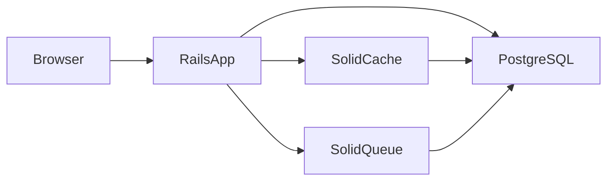

# AtlasQuant

Веб-приложение для отслеживания биржевых инструментов с фокусом на валютные фьючерсы и расчёт funding rate для perpetual-контрактов.

## О проекте

AtlasQuant помогает пользователям:

- отслеживать динамику инструментов в персональном списке;
- получать аналитику по текущим рыночным условиям;
- рассчитывать funding rate для perpetual-контрактов.

Подробнее о продукте, MVP scope и правилах для агентов — в [AGENTS.md](AGENTS.md).

## Стек

| Слой | Технология |
|------|------------|
| Backend | Ruby 3.2.11, Rails 8.1 |
| База данных | PostgreSQL 16 |
| Кэш / очереди / WebSocket | Solid Cache, Solid Queue, Solid Cable (PostgreSQL, без Redis) |
| Frontend | Tailwind CSS, Hotwire (Turbo + Stimulus), importmap |
| Деплой | Docker, Kamal |
| Среда разработки | [Mise](https://mise.jdx.dev/) |

## Требования

- [Mise](https://mise.jdx.dev/) — управление версиями инструментов
- Ruby **3.2.11**
- PostgreSQL **16**
- Node **22**

Версии зафиксированы в [`mise.toml`](mise.toml).

## Быстрый старт

```bash
# Установить Ruby, PostgreSQL, Node через Mise
mise install

# Зависимости, миграции и подготовка БД
mise exec -- bin/setup --skip-server

# Запуск dev-сервера + Tailwind CSS watch
mise exec -- bin/dev
```

Приложение доступно по адресу [http://localhost:3000](http://localhost:3000).

### Полезные команды

| Команда | Назначение |
|---------|------------|
| `bin/rails db:prepare` | Создание и миграция БД |
| `bin/jobs` | Воркеры Solid Queue |
| `bin/setup --reset` | Пересоздание БД (development) |

## Тестирование и CI

```bash
# Все тесты (Minitest)
bin/rails test

# Полный локальный CI-прогон
bin/ci
```

`bin/ci` последовательно запускает:

1. `bin/setup --skip-server`
2. RuboCop (`bin/rubocop`)
3. Bundler Audit (`bin/bundler-audit`)
4. Importmap audit (`bin/importmap audit`)
5. Brakeman (`bin/brakeman`)
6. Тесты Rails (`bin/rails test`)

Целевой стек тестирования для MVP — RSpec + SimpleCov (см. [AGENTS.md](AGENTS.md)); сейчас используется Minitest в каталоге `test/`.

## Архитектура



Доменная логика выносится в `app/services/`. Контроллеры MVP: `SessionsController`, `RegistrationsController`, `InstrumentsController` (planned), `DashboardController` (planned).

## Деплой

Production-деплой на TimeWeb VPS через Kamal и GitHub Actions. Пошаговая настройка, секреты и bootstrap VPS — в [docs/plans/-2.md](docs/plans/-2.md).

Секреты (`RAILS_MASTER_KEY`, пароли БД, SSH-ключи) хранятся только в GitHub Secrets / переменных окружения CI, не в репозитории.

## Документация

| Документ | Назначение |
|----------|------------|
| [AGENTS.md](AGENTS.md) | Продукт, MVP, security policy |
| [docs/index.md](docs/index.md) | Memory bank для агентов (SDD) |
| [docs/agent-pipeline/README.md](docs/agent-pipeline/README.md) | Конвейер Plane → CI → PR |

## Формат коммитов

Conventional Commits:

```
feat: добавить модель Instrument
fix: исправить расчёт funding rate
test: покрыть FundingCalculator спеками
chore: обновить зависимости
```

## Лицензия

Proprietary — см. репозиторий организации.
