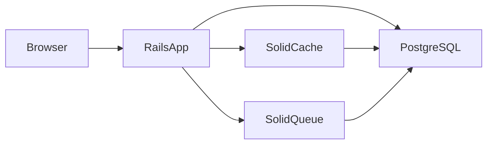

# AtlasQuant

Веб-приложение для отслеживания биржевых инструментов с фокусом на валютные фьючерсы и расчёт funding rate для perpetual-контрактов.

AtlasQuant помогает отслеживать динамику инструментов в персональном списке, получать аналитику по текущим рыночным условиям и рассчитывать funding rate для бессрочных контрактов.

## Текущий статус MVP

| Область | Статус |
|---------|--------|
| Авторизация (регистрация, вход, выход) | реализовано |
| CRUD инструментов | запланировано |
| Расчёт funding rate | запланировано |
| Дашборд с аналитикой | запланировано |

Подробные границы MVP и правила разработки — в [AGENTS.md](AGENTS.md).

## Стек

| Слой | Технология |
|------|------------|
| Backend | Ruby 3.2.11, Rails 8.1 |
| База данных | PostgreSQL 16 |
| Кэш / очереди / WebSocket | Solid Cache, Solid Queue, Solid Cable (PostgreSQL) |
| Frontend | Tailwind CSS, Hotwire (Turbo + Stimulus), importmap |
| Деплой | Docker, Kamal |

Redis **не используется** — все фоновые адаптеры Rails 8 Solid хранят данные в PostgreSQL.

## Требования

- Ruby 3.2.11
- PostgreSQL 16
- [Mise](https://mise.jdx.dev/) (рекомендуется) или эквивалентный менеджер версий

## Быстрый старт

```bash
# Установить Ruby и PostgreSQL через Mise
mise install

# Зависимости, подготовка БД и запуск dev-сервера
mise exec -- bin/setup

# Или только dev-сервер (если setup уже выполнен)
mise exec -- bin/dev
```

Приложение доступно по адресу [http://localhost:3000](http://localhost:3000).

`bin/dev` запускает Rails-сервер и Tailwind CSS watch через Foreman (`Procfile.dev`).

### Полезные команды

| Команда | Назначение |
|---------|------------|
| `bin/setup --skip-server` | Установка зависимостей и миграции без запуска сервера |
| `bin/setup --reset` | Сброс БД (`db:reset`) и setup |
| `bin/rails db:prepare` | Создание и миграция БД |
| `bin/jobs` | Запуск воркеров Solid Queue |
| `bin/rails console` | Rails console |

## Тестирование и CI

Сейчас используется Minitest (`test/`). Целевой стек — RSpec + SimpleCov (см. [AGENTS.md](AGENTS.md)).

```bash
# Запуск тестов
bin/rails test

# Полный локальный CI (lint, security scans, tests)
bin/ci
```

Локальный CI (`config/ci.rb`) последовательно выполняет: setup → rubocop → bundler-audit → importmap audit → brakeman → тесты.

GitHub Actions (`.github/workflows/ci.yml`) дополнительно запускает system tests.

## Деплой

Приложение упаковано в Docker (`Dockerfile`) и деплоится через [Kamal](https://kamal-deploy.org/) (`config/deploy.yml`).

```bash
# Настроить config/deploy.yml и .kamal/secrets, затем:
bin/kamal setup
bin/kamal deploy
```

В production Solid Queue может работать внутри Puma (`SOLID_QUEUE_IN_PUMA=true` в `config/deploy.yml`).

## Документация

| Документ | Описание |
|----------|----------|
| [AGENTS.md](AGENTS.md) | Продукт, MVP scope, security policy, команды |
| [docs/index.md](docs/index.md) | Memory bank и SDD pipeline |
| [docs/agent-pipeline/README.md](docs/agent-pipeline/README.md) | Конвейер Plane → Supercode → CI → PR |

## Архитектура



## Лицензия

Proprietary — см. репозиторий.
