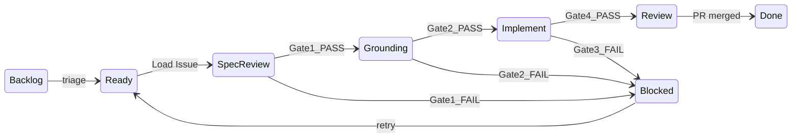

# Agent SWE Pipeline — AtlasQuant

Конвейер агентской разработки по модели **Spec-Driven Development** (курс [AI SWE](https://ai-swe-1.thinknetica.com)):

**Plane → Brief → Spec (TAUS) → Grounding → Implement → CI → Conformance → PR**

## Quality Gates

```
Brief (Plane issue, state: Agent Ready)
    ↓
[Gate 1] TAUS Spec Review     docs/specs/*.md → status: active  → Plane: Grounding
    ↓
[Gate 2] Grounding            plan vs codebase                   → Plane: Implement
    ↓
[Gate 3] CI                   bin/ci (lint, security, tests)
    ↓
[Gate 4] Spec Conformance     AC vs diff evidence                → Plane: Review
    ↓
[Gate 5] Human PR review      GitHub                             → Plane: Done (вручную)
```

Memory Bank: [docs/index.md](../index.md)

## Plane workflow statuses

Pipeline синхронизирует статусы задачи в Plane на каждом gate:

| Plane state | SDD этап | Триггер перехода |
|-------------|----------|------------------|
| **Agent Ready** | Ожидание агента | Человек переводит задачу в этот статус |
| **Spec Review** | Architect + Gate 1 | Load Issue / poller claim |
| **Grounding** | Gate 2 | `GATE_1: PASS` |
| **Implement** | Gate 3 | `GATE_2: PASS` |
| **Review** | Gate 4–5, PR | `GATE_4: PASS` / cloud agent success |
| **Blocked** | Сбой | Любой `GATE_*: FAIL` или agent error |
| **Done** | Завершено | Вручную после merge PR |



### Настройка статусов

```bash
cd .orchestrator
cp config.example.yml config.yml
cp .env.example .env
# Заполните PLANE_API_KEY

npm install
npm run setup:states   # создаёт Agent Ready, Spec Review, … в Plane
# Скопируйте UUID из вывода в config.yml и .env
```

## Быстрый старт (локально, Supercode)

### 1. Установить Supercode

Расширение: [supercode.sh/install](https://supercode.sh/en/install)

### 2. Pilot без Plane

1. Откройте проект AtlasQuant в Cursor
2. Supercode menu → buttons → **SWE Pipeline (Manual)**
3. Введите задачу, например:
   ```
   feat: User model + SessionsController + has_secure_password
   ```
4. Pipeline: Architect → TAUS → Grounding → Implement → CI → Conformance → Review

### 3. Pilot с Plane

1. Скопируйте `.supercode/workflows/atlasquant/.env.example` → `.env`
2. Заполните `PLANE_API_KEY`, `PLANE_WORKSPACE`, `PLANE_PROJECT_ID`, `PLANE_ISSUE_IDENTIFIER`, `PLANE_STATE_*`
3. Переведите задачу в Plane в статус **Agent Ready**
4. Supercode menu → **SWE Pipeline (Plane)**

## Cloud Agent (удалённое исполнение)

### 1. Настройка orchestrator

```bash
cd .orchestrator
cp config.example.yml config.yml
cp .env.example .env
# Заполните CURSOR_API_KEY, PLANE_API_KEY, github.repo_url, plane.states.*

npm install
npm run setup:states
```

### 2. Pilot cloud agent (без Plane)

```bash
export CURSOR_API_KEY=cursor_...
npm run agent -- --pilot
```

Cloud agent получает SDD workflow с quality gates в промпте.

### 3. Cloud agent для задачи Plane

```bash
npm run agent -- --issue=<work-item-uuid>
```

Переходы: `Agent Ready → Spec Review → Review|Blocked`

### 4. Poller (Plane state `Agent Ready`)

```bash
npm start              # каждые 5–10 мин
npm start -- --once    # один проход
```

Poller ищет задачи в статусе **Agent Ready**, атомарно переводит в **Spec Review** и запускает cloud agent.

## Миграция с label `agent-ready`

1. Запустите `npm run setup:states`
2. Переведите задачи из label `agent-ready` в статус **Agent Ready** в Plane UI
3. Label можно оставить визуально — poller больше не использует его
4. Удалите `PLANE_AGENT_READY_LABEL_ID` из `.env` (если был)

## Структура

```
docs/
├── index.md                          # Memory Bank index
├── specs/                            # Spec Pack (TAUS)
│   ├── README.md
│   └── _template.md
├── plans/                            # Implementation plans
└── agent-pipeline/
    ├── README.md
    └── templates/agent-run/          # Ralph Loop templates

.supercode/workflows/atlasquant/
├── swe-pipeline.yml                  # полный SDD конвейер
├── swe-architect.yml                 # spec + plan (draft)
├── swe-spec-review.yml               # Gate 1: TAUS
├── swe-grounding.yml                 # Gate 2
├── swe-implement.yml                 # Gate 3: code + CI loop
├── swe-spec-conformance.yml          # Gate 4
└── scripts/
    ├── fetch-plane-issue.sh
    ├── update-plane-state.sh         # PATCH Plane state by key
    ├── init-agent-run.sh             # Ralph Loop init
    └── run-ci-gate.sh

.agent-run/                           # gitignored, per-session state
.orchestrator/                        # Cursor Cloud Agent + Plane poller
```

## Workflow stages

| Этап | Supercode | Plane state | Cloud Agent |
|------|-----------|-------------|-------------|
| Intake | `fetch-plane-issue.sh` | → Spec Review | `buildAgentPrompt()` |
| Architect | SWE Architect | Spec Review | Phase 1 in prompt |
| Gate 1 TAUS | SWE Spec Review Loop | → Grounding / Blocked | Self TAUS in prompt |
| Gate 2 Grounding | SWE Grounding Loop | → Implement / Blocked | Phase 2 in prompt |
| Gate 3 Implement | SWE Implement + CI loop | Implement / Blocked | Phase 3–4 in prompt |
| Gate 4 Conformance | SWE Spec Conformance Loop | → Review / Blocked | AC evidence in prompt |
| Gate 5 Review | Final Review step | Review | PR with evidence table |

## Ralph Loop (длинные задачи)

При fetch из Plane или Architect автоматически создаётся `.agent-run/`:

| Файл | Назначение |
|------|------------|
| `PROMPT.md` | Launcher instructions |
| `plan.md` | Checkbox progress |
| `active-context.md` | Current focus |
| `verification-loop.md` | CI failures, checks |
| `session-handoff.md` | Resume point |

## Adapt routing

| Сбой | Вернуть на | Plane state |
|------|------------|-------------|
| CI red | Implement | Blocked → retry |
| Plan vs code conflict | Architect + Grounding | Blocked |
| AC not met | Implement | Blocked |
| Spec ambiguous | Architect + Spec Review | Blocked |

## Следующие шаги

- [ ] Push на GitHub → `GITHUB_REPO_URL` в config.yml
- [ ] Pilot: **SWE Pipeline (Manual)** на User auth
- [ ] Cloud smoke: `npm run agent -- --pilot`
- [ ] Запустить poller как systemd/cron service
