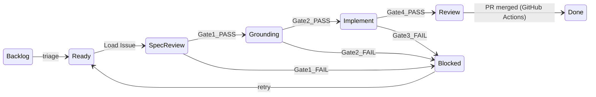

# Agent SWE Pipeline — AtlasQuant

Конвейер агентской разработки по модели **Spec-Driven Development** (курс [AI SWE](https://ai-swe-1.thinknetica.com)):

**Plane → Brief → Spec (TAUS) → Grounding → Implement → CI → Conformance → PR**

## Quality Gates

```
Brief (Plane issue, state: Agent Ready)
    ↓
[Gate 1] TAUS Spec Review     Plane Pages spec/plan → status: active  → Plane: Grounding
    ↓
[Gate 2] Grounding            plan vs codebase                   → Plane: Implement
    ↓
[Gate 3] CI                   bin/ci (lint, security, tests)
    ↓
[Gate 4] Spec Conformance     AC vs diff evidence                → Plane: Review
    ↓
[Gate 5] Human PR review      GitHub                             → Plane: Done (авто при merge PR)
```

Memory Bank: [docs/index.md](../index.md)

## Plane workflow statuses

Pipeline синхронизирует статусы задачи в Plane на каждом gate:

| Plane state | SDD этап | Триггер перехода |
|-------------|----------|------------------|
| **Agent Ready** | Ожидание агента | Человек переводит задачу в этот статус |
| **Spec Review** | Architect + Gate 1 | Load Issue / poller claim |
| **Grounding** | Gate 2 | `GATE_1: PASS` |
| **Implement** | Gate 3 | `GATE_2: PASS` |
| **Review** | Gate 4–5, PR | `GATE_4: PASS` / cloud agent success |
| **Blocked** | Сбой | Любой `GATE_*: FAIL` или agent error |
| **Done** | Завершено | GitHub Actions при merge PR |



### Настройка статусов

```bash
cd .orchestrator
cp config.example.yml config.yml
cp .env.example .env
# Заполните PLANE_API_KEY

npm install
npm run setup:states   # создаёт Agent Ready, Spec Review, … в Plane
# Скопируйте UUID из вывода в config.yml и .env
```

## Быстрый старт (локально, Supercode)

### 1. Установить Supercode

Расширение: [supercode.sh/install](https://supercode.sh/en/install)

### 2. Pilot без Plane

1. Откройте проект AtlasQuant в Cursor
2. Supercode menu → buttons → **SWE Pipeline (Manual)**
3. Введите задачу, например:
   ```
   feat: User model + SessionsController + has_secure_password
   ```
4. Pipeline: Architect → TAUS → Grounding → Implement → CI → Conformance → Review

### 3. Pilot с Plane (Plane MCP)

1. Настройте Plane MCP для self-hosted инстанса:
   ```bash
   cd AtlasQuant
   cp .supercode/workflows/atlasquant/.env.example .supercode/workflows/atlasquant/.env
   # Заполните PLANE_API_KEY, PLANE_ISSUE_IDENTIFIER, PLANE_STATE_*
   mise run plane-mcp:setup   # генерирует ../.cursor/mcp.json (stdio → plane.alfapulse.ru)
   ```
2. Reload Cursor (`Cmd+Shift+P → Reload Window`), проверьте MCP server **plane** в Settings
3. Переведите задачу в Plane в статус **Agent Ready**
4. Supercode menu → **SWE Pipeline (Plane)** → **Load Plane Issue (MCP)**

> **Важно:** глобальный `~/.cursor/mcp.json` с `mcp.plane.so` работает только с Plane Cloud.
> Для self-hosted `plane.alfapulse.ru` нужен stdio-сервер (`plane-mcp-server`) через `mise run plane-mcp:setup`.

### Plane MCP в pipeline

| Этап | Было (curl) | Стало (MCP) |
|------|-------------|-------------|
| Load Issue | `fetch-plane-issue.sh` | `retrieve_work_item*` + `update_work_item` |
| Gate transitions | `update-plane-state.sh` | `update_work_item` + `create_work_item_comment` |

Контекст (project_id, state UUIDs): `bash .supercode/workflows/atlasquant/scripts/plane-mcp-context.sh load`

Cloud orchestrator (`.orchestrator/`) по-прежнему использует Plane REST API — у cloud agent нет MCP.

## Cloud Agent (удалённое исполнение)

### 1. Настройка orchestrator

```bash
cd .orchestrator
cp config.example.yml config.yml
cp .env.example .env
# Заполните CURSOR_API_KEY, PLANE_API_KEY, github.repo_url, plane.states.*

mise install
mise run orchestrator:install
npm run setup:states
```

### 2. Pilot cloud agent (без Plane)

```bash
export CURSOR_API_KEY=cursor_...
mise run orchestrator:agent -- --pilot
```

Cloud agent получает SDD workflow с quality gates в промпте.

### 3. Cloud agent для задачи Plane

```bash
mise run orchestrator:agent -- --issue=<work-item-uuid>
```

Переходы: `Agent Ready → Spec Review → Review|Blocked`

### 4. Poller (Plane state `Agent Ready`)

```bash
mise run orchestrator:start        # каждые 5–10 мин
mise run orchestrator:once         # один проход
```

Poller ищет задачи в статусе **Agent Ready**, атомарно переводит в **Spec Review** и запускает cloud agent.

## Миграция с label `agent-ready`

1. Запустите `npm run setup:states`
2. Переведите задачи из label `agent-ready` в статус **Agent Ready** в Plane UI
3. Label можно оставить визуально — poller больше не использует его
4. Удалите `PLANE_AGENT_READY_LABEL_ID` из `.env` (если был)

## Структура

```
docs/
├── plane-pages/manifest.yml          # external_id → page_id
├── index.md                          # archived snapshot (source: Plane Page)
├── specs/                            # archived snapshots
├── plans/
└── agent-pipeline/
    ├── README.md
    └── templates/agent-run/          # Ralph Loop templates

.supercode/workflows/atlasquant/
├── swe-pipeline.yml                  # полный SDD конвейер
├── swe-architect.yml                 # spec + plan (draft)
├── swe-spec-review.yml               # Gate 1: TAUS
├── swe-grounding.yml                 # Gate 2
├── swe-implement.yml                 # Gate 3: code + CI loop
├── swe-spec-conformance.yml          # Gate 4
└── scripts/
    ├── plane-mcp-server.sh           # stdio wrapper для Cursor MCP
    ├── plane-mcp-context.sh          # контекст для Supercode prompts
    ├── setup-plane-mcp.sh            # генерирует .cursor/mcp.json
    ├── fetch-plane-issue.sh          # DEPRECATED fallback (REST)
    ├── update-plane-state.sh         # REST fallback (CI + headless)
    ├── sync-plane-on-pr-merge.sh     # GitHub Actions: PR merge → Done
    ├── plane-pages-context.sh        # Pages external_id / MCP context
    ├── plane-pages.sh                # Pages CLI (SSH → Django ORM)
    ├── migrate-docs-to-plane-pages.sh
    └── run-ci-gate.sh

.agent-run/                           # gitignored, per-session state
.orchestrator/                        # Cursor Cloud Agent + Plane poller
```

## Workflow stages

| Этап | Supercode | Plane state | Cloud Agent |
|------|-----------|-------------|-------------|
| Intake | Plane MCP (`retrieve_work_item*`) | → Spec Review | `buildAgentPrompt()` |
| Architect | SWE Architect | Spec Review | Phase 1 in prompt |
| Gate 1 TAUS | SWE Spec Review Loop | → Grounding / Blocked | Self TAUS in prompt |
| Gate 2 Grounding | SWE Grounding Loop | → Implement / Blocked | Phase 2 in prompt |
| Gate 3 Implement | SWE Implement + CI loop | Implement / Blocked | Phase 3–4 in prompt |
| Gate 4 Conformance | SWE Spec Conformance Loop | → Review / Blocked | AC evidence in prompt |
| Gate 5 Human | GitHub PR review → merge | Done (GitHub Actions) | — |

## Ralph Loop (длинные задачи)

При fetch из Plane или Architect автоматически создаётся `.agent-run/`:

| Файл | Назначение |
|------|------------|
| `PROMPT.md` | Launcher instructions |
| `plan.md` | Checkbox progress |
| `active-context.md` | Current focus |
| `verification-loop.md` | CI failures, checks |
| `session-handoff.md` | Resume point |

## Adapt routing

| Сбой | Вернуть на | Plane state |
|------|------------|-------------|
| CI red | Implement | Blocked → retry |
| Plan vs code conflict | Architect + Grounding | Blocked |
| AC not met | Implement | Blocked |
| Spec ambiguous | Architect + Spec Review | Blocked |
| **Missing info / unclear brief** | **Plane comment `[Needs Info]`** | **Blocked** (human reply → Agent Ready) |

Подробности: [agent-clarification.md](agent-clarification.md)

## GitHub Actions: Plane sync при merge PR

Workflow `.github/workflows/sync-plane-status.yml` срабатывает при **merged** pull request и переводит связанные задачи Plane в **Done**.

### Как связать PR с задачей

Идентификатор `ATLASQUANT-N` ищется в (в любом порядке):

- имени ветки — `feature/ATLASQUANT-12-user-auth`
- заголовке PR — `[ATLASQUANT-12] feat: …`
- теле PR — `Plane: ATLASQUANT-12`

Несколько идентификаторов в одном PR обрабатываются все.

### Secrets в GitHub (Settings → Secrets and variables → Actions)

| Secret | Пример |
|--------|--------|
| `PLANE_API_KEY` | API key из Plane |
| `PLANE_BASE_URL` | `https://plane.alfapulse.ru` |
| `PLANE_WORKSPACE` | `atlasquant` |
| `PLANE_PROJECT_ID` | UUID проекта |
| `PLANE_STATE_DONE` | UUID статуса Done |

Опционально **variable** `PLANE_PROJECT_PREFIX` (по умолчанию `ATLASQUANT`).

Значения UUID — из `.supercode/workflows/atlasquant/.env` или `npm run setup:states` в `.orchestrator/`.

### Локальная проверка (dry-run)

```bash
PR_BRANCH=feature/ATLASQUANT-1-auth \
PR_TITLE="feat: sessions" \
PR_URL=https://github.com/naveroot/AtlasQuant/pull/1 \
PLANE_DRY_RUN=1 \
bash .supercode/workflows/atlasquant/scripts/sync-plane-on-pr-merge.sh
```

### Webhook (альтернатива)

Для self-hosted webhook вместо Actions можно вызвать тот же скрипт из endpoint'а, передав `PR_BRANCH`, `PR_TITLE`, `PR_BODY`, `PR_URL` из payload GitHub `pull_request` (action `closed`, `merged: true`).

## Следующие шаги

- [ ] Push на GitHub → `GITHUB_REPO_URL` в config.yml
- [ ] Добавить GitHub Actions secrets для Plane sync
- [ ] Pilot: **SWE Pipeline (Manual)** на User auth
- [ ] Cloud smoke: `mise run orchestrator:agent -- --pilot`
- [ ] Запустить poller как systemd/cron service
